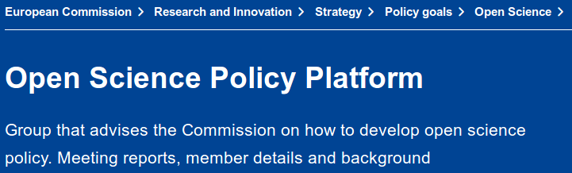
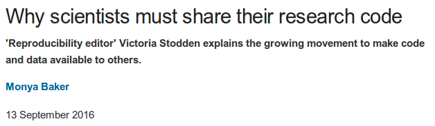
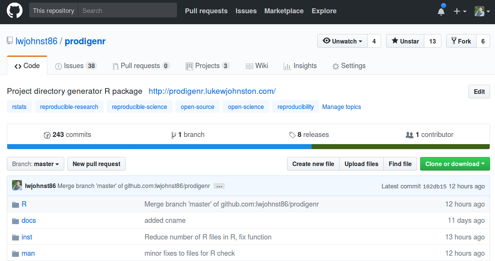

<style type="text/css">
slides > slide:not(.nobackground):after {
  content: '';
}
@media print {
  a[href]:after {
    content: none !important;
  }
}
</style>

## Demand for more open science





## Why need a toolkit for open science workflows?

```{r setup, include=FALSE}
knitr::opts_chunk$set(echo = FALSE)
```

<!-- instructions: 15 slides max, 20 sec each, 5 min total -->

, 3/12/2014](images/phd-comics-code-scratch.gif)

## Current available packages/workflows

- [rrtools]
- [ProjectTemplate]
- [makeProject]
- [devtools], [usethis] directly
    
[rrtools]: https://github.com/benmarwick/rrtools
[devtools]: https://github.com/r-lib/devtools
[usethis]: https://github.com/r-lib/usethis
[ProjectTemplate]: http://projecttemplate.net/
[makeProject]: https://CRAN.R-project.org/package=makeProject

## ... Just another competing package?


## ... Probably. But, there are still things missing or not addressed

- Fairly complicated or assume complex analyses
- Don't automate enough
- Not targeted to "casual coders" 
    - e.g. most health researchers
- Are not opinionated enough
    - "Here are options and a general workflow, you decide the rest"
    <!-- great for advanced users... not casual users -->

## What is needed and why?

- Lots of support and guidance <!--for casual users, this is good-->
    - Many (health) researchers *don't know* what open science is
    - Or *how to do it*
- Opinionated on what services and tools to use
    - So many tools and "moving parts"... it's *overwhelming*
- Automate most tasks, rather than through documentation
    - *Default* for open science should be *easy*

## Enter the [prodigenr] package

</img>
<!-- started in PhD because I kept having to copy previous projects and removing
content -->

[prodigenr]: http://prodigenr.lukewjohnston.com/

## Main function... 

Generate project directory, `setup_project()`:

```{r structure_project, echo=FALSE, eval=TRUE, results='markup', comment=''}
cat(readLines('structure_project.txt', warn = FALSE), sep = '\n')
```

## ... similar structure to R packages

Advantages:

- Established infrastructure
- Well developed through [devtools], [usethis]
- Handles range of project difficulty (simple to complex)

## Some of the other functions: 

Adding scientific product file, e.g. manuscript, `create_manuscript()`:

```{r structure_doc, echo=FALSE, eval=TRUE, results='markup', comment=''}
cat(readLines('structure_doc.txt', warn = FALSE), sep = '\n')
```

<!--
## Other functions: 

- Add author(s) to project metadata (=DESCRIPTION file):
    - `add_first_author()`
    - `add_coauthor()`
- Add tag and version to project at e.g. time of submission:
-->

## Next steps and future plans

- Focus prodigenr on project generation
- Tag/version bump after e.g. manuscript submission
- Reproducibility tools (e.g. travis, docker)
- Other functionality to new package, [rostools](https://github.com/lwjohnst86/rostools)
- Teaching material and more docs

## Current stage of development

- Participating in [Mozilla Open Project Leader Training](https://mozilla.github.io/leadership-training/round-5/projects/#an-r-software-toolkit-to-simplify-an-open-collaborative-scientif)
- Featured on [Mozilla Pulse](https://www.mozillapulse.org/entry/643)
    - Participated in [Global Sprint](https://github.com/mozilla/global-sprint/issues/152)
    - Gained some contributors/feedback
- Just submitted next version to CRAN

## How does this help? 

- Open science is constantly evolving 
- Package automates and bundles together common tools 
    - (of course, strongly opinionated on which tools to use)
- Natural extension to the [devtools]/[usethis] framework
- Researchers need tools, *this a first step* toward that

## Reason for this talk...

- Looking for feedback, thoughts, comments
- But mostly... seeking potential contributors/collaborators!

<!-- -->

- **Contact info:**
    - GitHub: [`@lwjohnst86`](https://github.com/lwjohnst86)
    - Email: lwjohnst@ph.au.dk
    - Slides: https://github.com/lwjohnst86/erum2018

</img>

<small>
<a rel="license" href="http://creativecommons.org/licenses/by/4.0/"></a><br>Licensed under a <a rel="license" href="http://creativecommons.org/licenses/by/4.0/">CC-BY 4.0 International License</a>.
</small>
